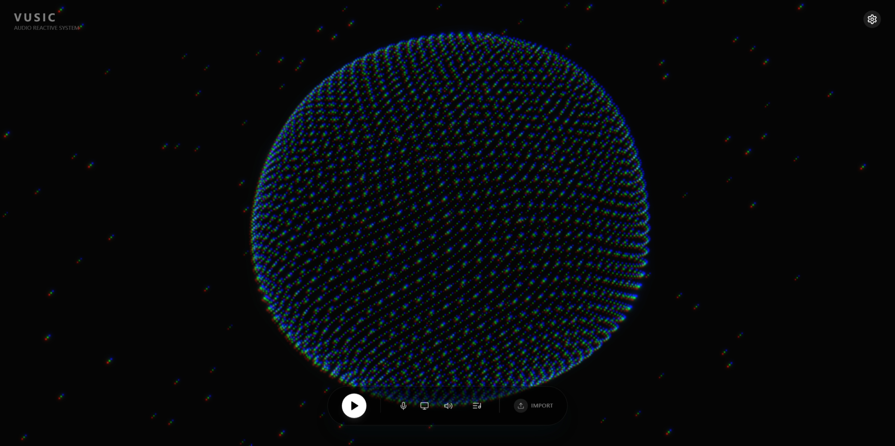

# Vusic



**Vusic** is a high-performance audio reactive visualizer built with React Three Fiber.
**Vusic** 是一个基于 React Three Fiber 构建的高性能音频响应可视化系统。

## Features / 特性

- **Dual Input Modes**: Separate Microphone and System Audio inputs (Loopback).
- **Audio Reactive**: Physics-based particle simulations driven by frequency data.
- **Customizable**: Adjustable Bloom, Colors, Particle Size, and Sphere Radius.
- **Modern Stack**: Vite + React + Three.js + Zustand + Tailwind.

- **双模输入**：独立的麦克风与系统内部音频（内录）支持。
- **音频响应**：基于频率数据的物理粒子模拟。
- **高度客制**：支持调节光晕（Bloom）、主题色、粒子及球体大小。
- **现代技术栈**：Vite + React + Three.js + Zustand + Tailwind。

## Quick Start / 快速开始

```bash
# Clone the repository
git clone https://github.com/Freakz3z/Vusic.git

# Install dependencies
npm install

# Run development server
npm run dev
```

## Setup System Audio / 设置系统音频内录

1. Click the **Monitor** icon (Cyan button) in the controls.
2. Select **"Entire Screen"** or **"Tab"** in the browser prompt.
3. **CHECK** the **"Share Audio"** box.
   
1. 点击控制栏中的 **监听** 图标（青色按钮）。
2. 在浏览器弹窗中选择 **"整个屏幕"** 或 **"标签页"**。
3. **务必勾选 "分享音频"**。

## License / 协议

MIT License © [Freakz3z](https://github.com/Freakz3z)
